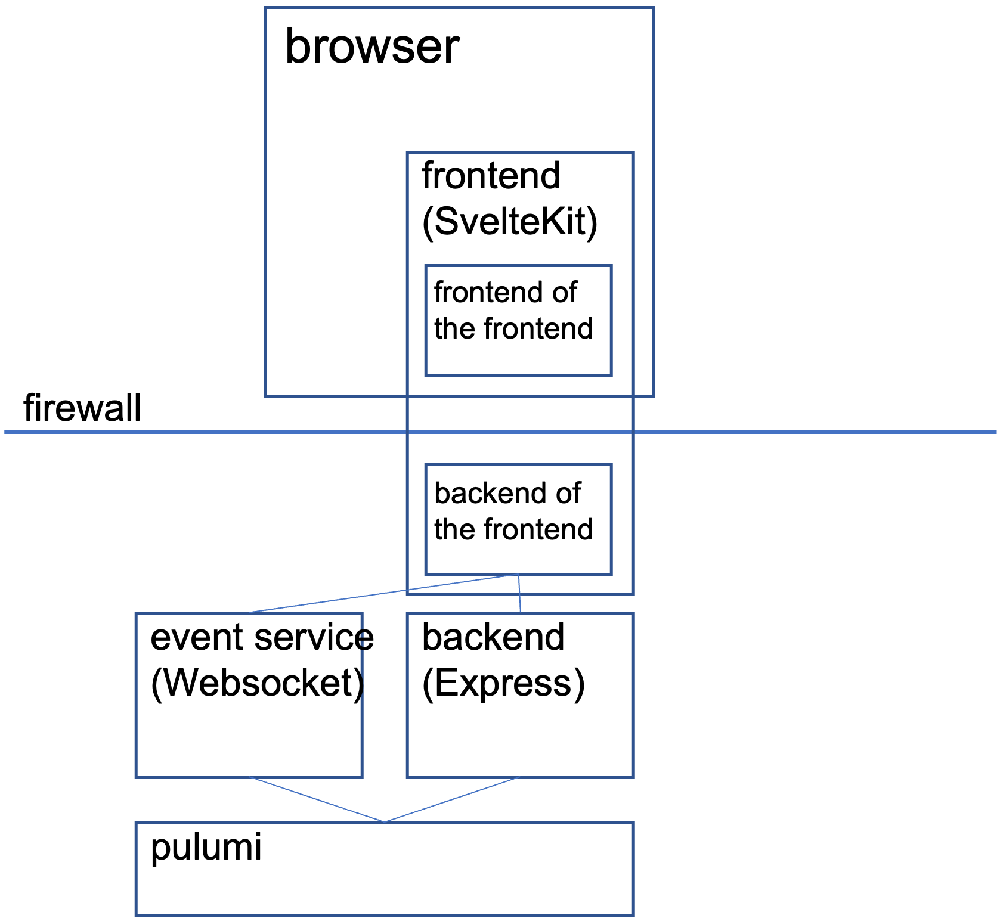
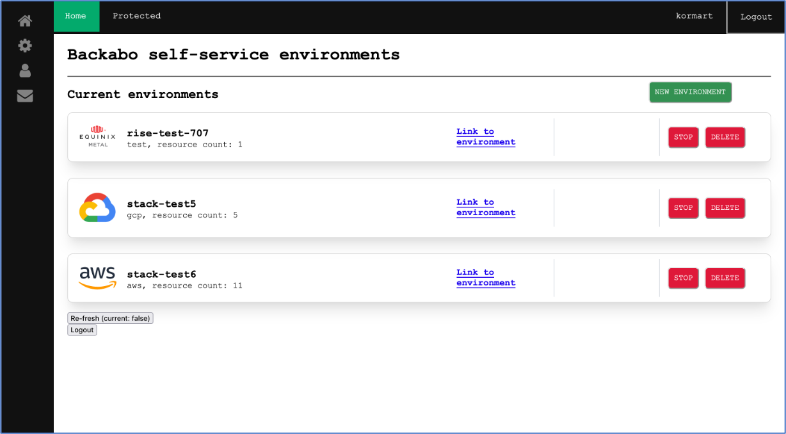
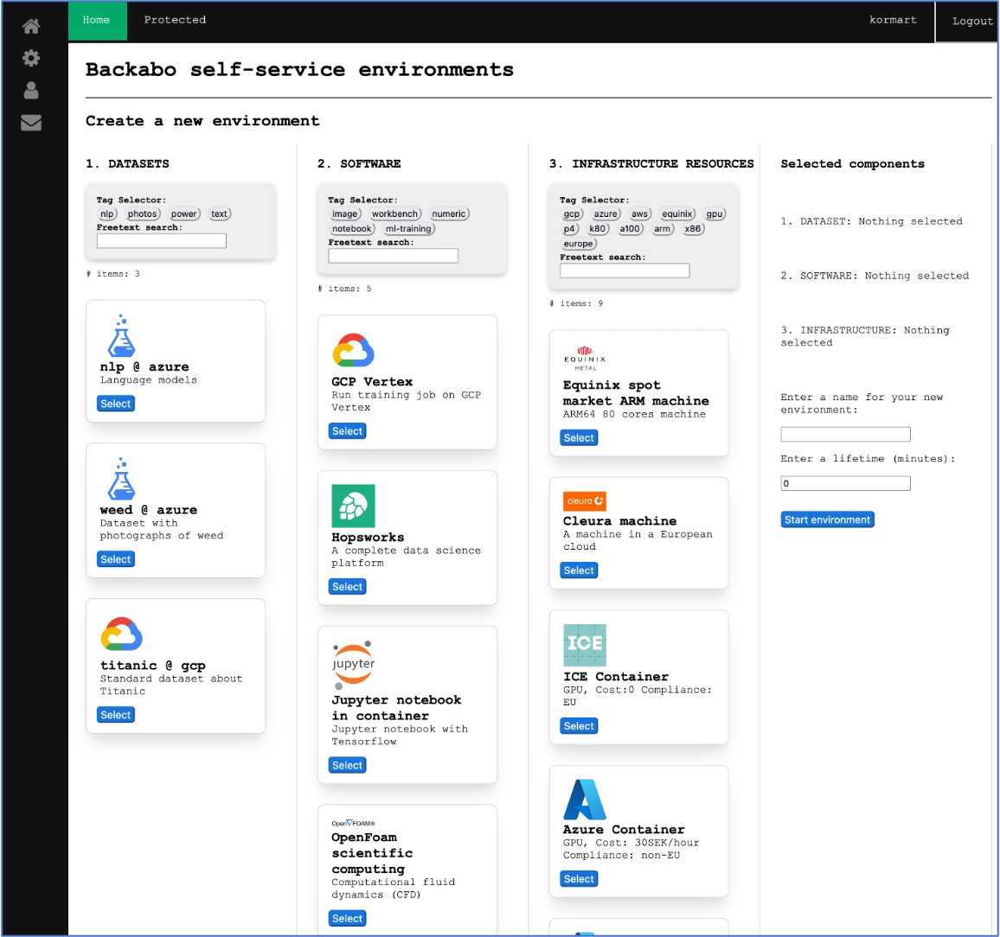

# Backabo self-service environments

This project is in an experimental phase, meant for functional usage validation. There has been very little non-functional testing.

This is a multi-cloud environment service built on top of Pulumi. The frontend is built with SvelteKit, the backend is an Express server that uses the Pulumi automation api, and there is an event-service that uses Websockets. The README files in the respective folders give more references.

The service depends on a set of environment variables (containing credentials and configurations for the cloud resource providers) that are assumed to be defined in a file setup.sh, which is not included in this repo.

The service depends on that Pulumi is installed and configured, for testing purposes with a local file state store, no Pulumi subscription is needed.

## Frontend

https://kit.svelte.dev/docs/introduction

The frontend is built with SvelteKit. SvelteKit has its own backend (Backend-for-frontend pattern) that helps with calls to the actual backend in a secure way.

## Backend

The backend is an Express server that serves endpoints for the operations: list, create, delete, which all triggers calls to the Pulumi automation API. The backend also serves the content of the smorgasbord file, which describes the possible resource components. 

## Pulumi

https://www.pulumi.com/docs/

The Pulumi CLI must be installed. The Pulumi plugins are determined by the package.json file.

## Event service

A Websocket server that waits for the Frontend to make connection. Then it reads state data from Pulumi and sets up timers. It then starts to send messages back to the Frontend. At time-out a stack is deleted using the Pulumi automation API. 

## System architecture

## User interface

Showing the current environments.

Showing the choices when starting a new environment.

